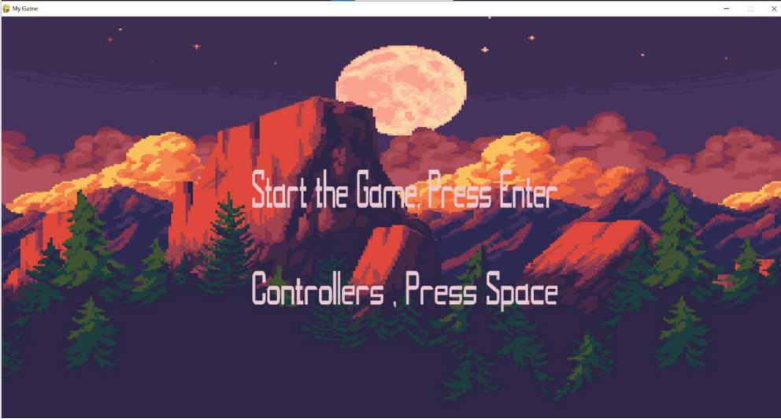
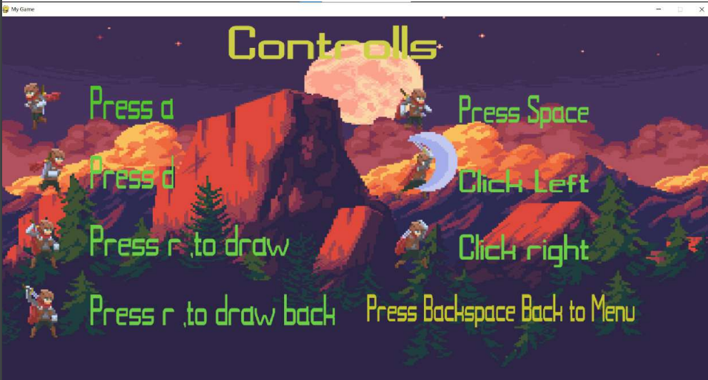
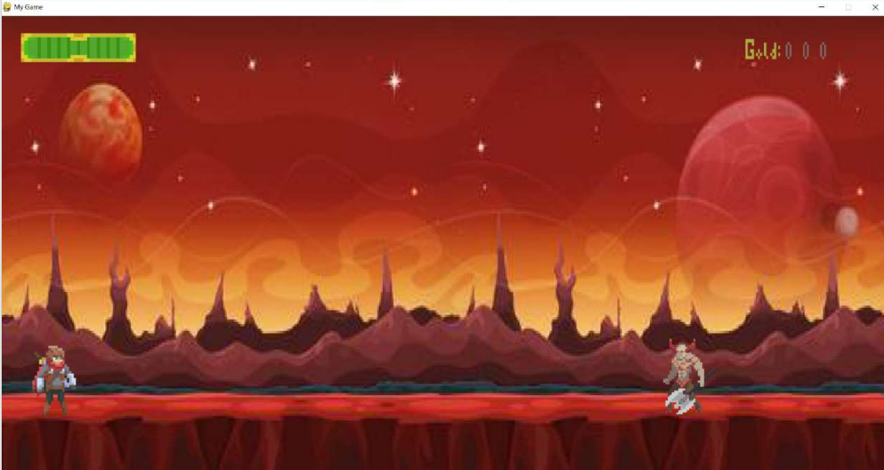
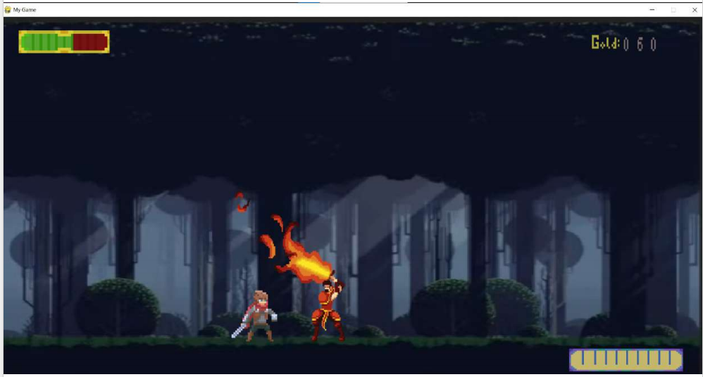

# Adventure-Game-OOP: A Pygame Based Combat Adventure

**A 2D adventure game built with object-oriented programming principles, featuring engaging combat mechanics and progressive enemy encounters.**

<p align="center">
  
  
  <br>
  
  
</p>

---

## 🎮 Features
- **OOP Fundamentals**: Inheritance, polymorphism, and encapsulation.
- **Combat System**: 
  - Light attack (fast) & heavy attack (slow but powerful).
  - Unique animations for each attack type.
- **Progressive Difficulty**: 
  - Enemy waves with increasing strength.
  - Final boss battle with complex attack patterns.
- **Character Progression**: Collect gold to enhance abilities.

---

## 📂 Project Structure
```plaintext
Adventure-Game-OOP/
├── program/                 # Core game logic
│   ├── Entity.py            # Base class (Entity)
│   ├── Character.py         # Player controls & abilities
│   ├── Boss.py              # Boss AI and mechanics
│   ├── DemonAxe.py          # Standard enemy behavior
│   ├── Level.py             # Level transitions & logic
│   └── ResourceManager.py   # Singleton resource loader
└── others/                  # Game assets
    ├── Character_images/    # Player spritesheets
    ├── Boss/                # Boss animations
    ├── DemonAxe/            # Enemy sprites
    ├── images/              # UI/Backgrounds
    └── readme.txt           # Asset credits
```
## ⚙️ Technical Architecture
```plaintext
Core Classes
Class	Description
Entity	Base class for all game objects (player, enemies). Handles position, health.
Character	Player-controlled entity with jump/attack mechanics.
Enemy (Abstract)	Base enemy class. Inherited by DemonAxe and Boss.
ResourceManager	Singleton class for loading images/sounds.
Key Mechanics
Wave System: Spawn enemies based on player progression (Level.py).

Boss Fight: Multi-phase battle with dynamic attack patterns (Boss.py).
```

## 🚀 Getting Started
Installation
Clone the repository:
```plaintext
bash
git clone https://github.com/KadirGokdeniz/Adventure-Game-OOP.git
```
### Install dependencies:
```plaintext
bash
pip install pygame==2.0.0
```
### Launching the Game
```plaintext
bash
cd Adventure-Game-OOP
python program/main.py
```
Controls
Action	Key/Mouse
Move Left/Right	A / D
Jump	Space
Light Attack	Left Mouse Click
Heavy Attack	Right Mouse Click
Pause/Menu Navigation	ESC / Backspace
## 🤝 Contributing
Fork the repository.

### Create a branch:
```plaintext
bash
git checkout -b feature/your-feature
```
### Commit changes:
```plaintext
bash
git commit -m "feat: add your feature"
```
### Push to GitHub:
```plaintext
bash
git push origin feature/your-feature
```
Open a Pull Request with a detailed description.

## 📌 Roadmap
New Enemy Types: Flying enemies & ranged attackers.

Level Editor: Custom level creation tool.

Soundtrack: Dynamic music for combat/exploration.

## 📜 License
Distributed under the MIT License. See LICENSE for details.

Contact: Kadir Gökdeniz - kadirqokdeniz@hotmail.com

Project Link: https://github.com/KadirGokdeniz/Adventure-Game-OOP
