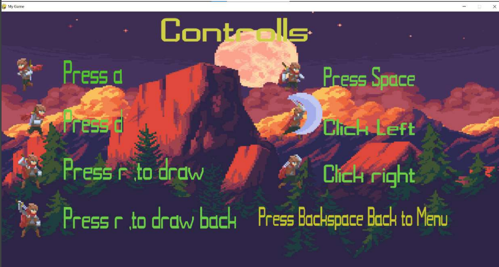

<h1 align="center">Hi 👋, I'm Kadir</h1>
<h3 align="center">A passionate ML&AI developer from Turkey</h3>

<h3 align="left">Connect with me:</h3>

<h3 align="left">Languages and Tools:</h3>

            

<h3 align="center">An Adventure Game</h3>

Welcome to the A-Game-Classes-OOP project! This project is aimed at designing an adventure game using object-oriented programming principles. It consists of two main files: `others` and `program`.Furthermore, you can easily access and explore the game without the need to download or execute any commands. Simply click on the 'example.pdf' file located in the 'others' directory to view it.

## others

The `others` folder contains animations and images that will be used in the game. If you wish, you can also access the instructions by referring to the `readme.txt` file inside the `others` folder.

## program

The `program` file contains the necessary classes for the game. These classes are implemented using object-oriented programming concepts to facilitate game development.

## Requirements

To run the game, make sure you have the Pygame library installed on your computer. Pygame is a cross-platform set of Python modules designed for writing video games.

## Getting Started

1. Clone the repository to your local machine.

git clone https://github.com/KadirGokdeniz/Adventure-Game-OOP.git

2. Install the Pygame library using pip.

pip install pygame

3. Run the game by executing the main file.

python others.py

4. Upon running the game, you will be greeted with an initial menu screen. Press the space bar to access the instructions. Press the backspace key to return to the main menu. Press Enter to start the game.

5. During the game, the main character has two different attack types. Left-clicking performs rapid attacks, while right-clicking performs slower but stronger attacks. Be mindful of the DemonAxel enemies that appear in different waves. Defeat all the DemonAxels to proceed to the next level.

6. After defeating all the DemonAxels, advance to the far right of the level to encounter our boss character, who has two different attack styles. Avoid getting too close to them and engage in battle. 

7. Have fun and enjoy the game!

## Contact
- For any inquiries or questions, please feel free to contact me at kadirqokdeniz@hotmail.com.

